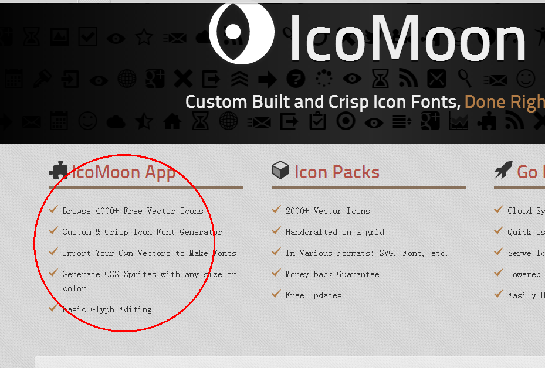
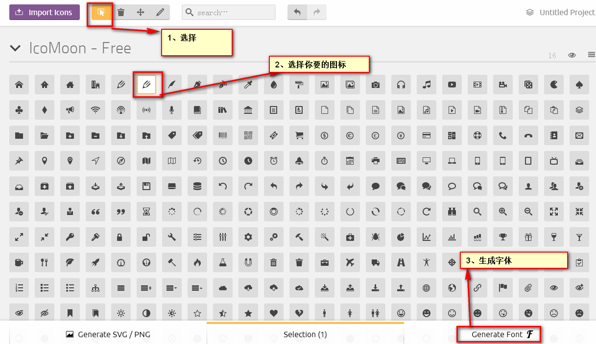
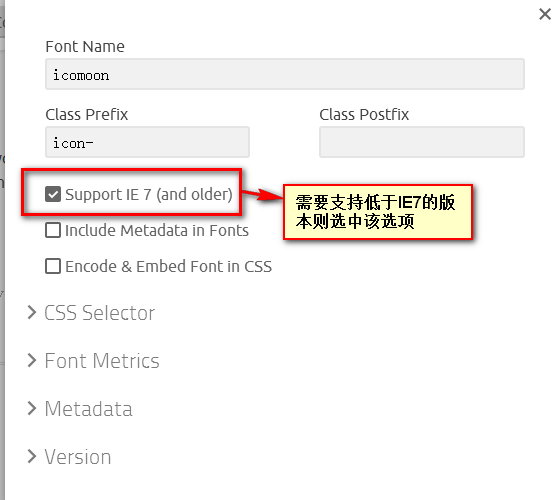
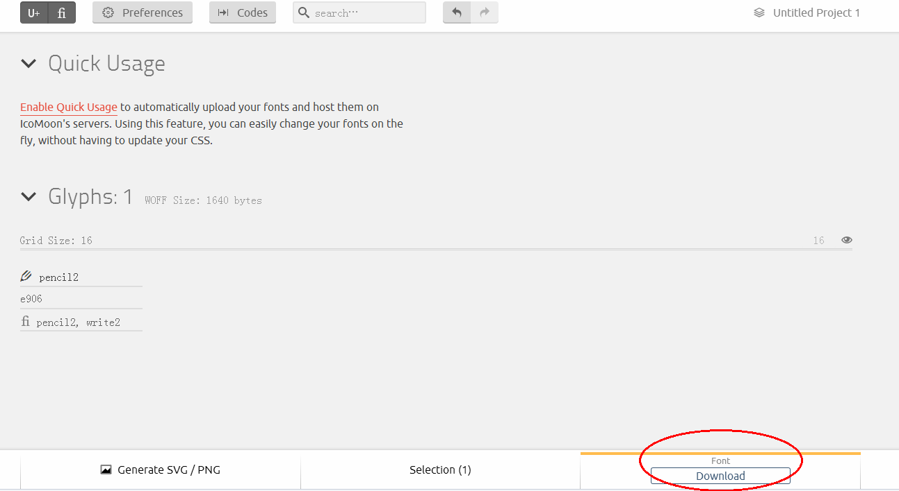
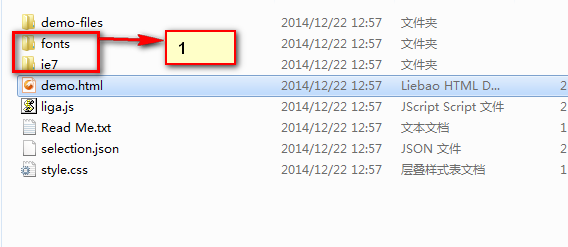
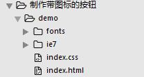

制作图标
=========================== 

## 获得字体资源

+ 打开[页面](https://icomoon.io/#home "图标字体页面").
+ 点击红色圈中的位置 
+ 按步骤操作 
+ 点击  
+ 选中红色部分   
+ 点击download   

## 使用

+ 解压下载的字体文件。选择文件夹（圈中部分）拷贝到你的项目中: 
+ 完成后，你的项目结构。    
+ 将解压后的中的style.css中的内容拷贝到你的项目的index.css中。
+ 在index.html中引入资源

    <link rel="stylesheet" href="index.css">
    <!--[if lt IE 8]><!-->
    <link rel="stylesheet" href="ie7/ie7.css">
    <!--<![endif]-->
        

+ 将图标元素加入到index.html中。 class是解压后中style.css中指定的样式。
      
      
  

